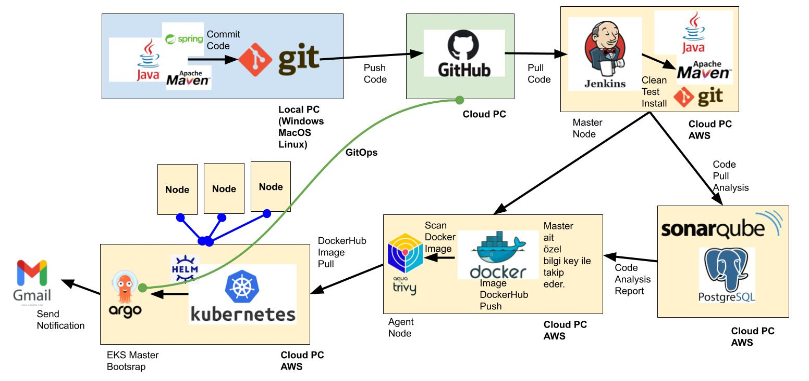
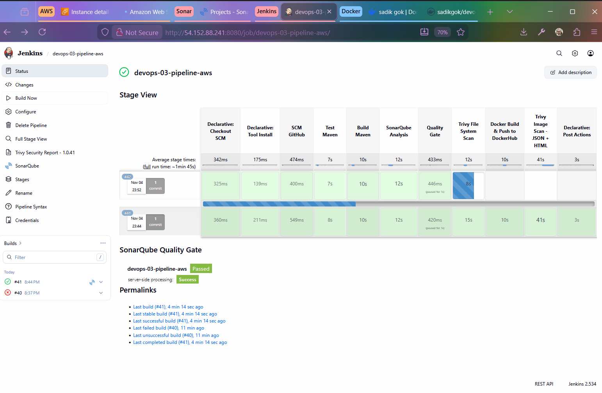
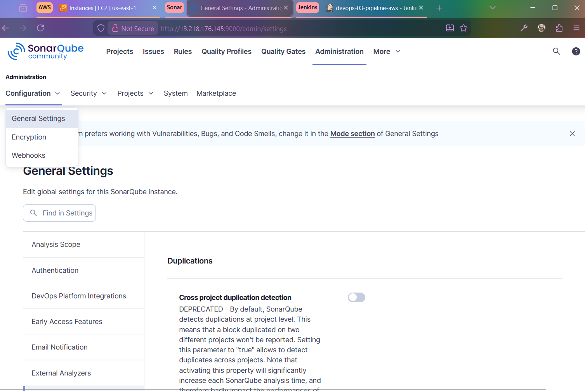
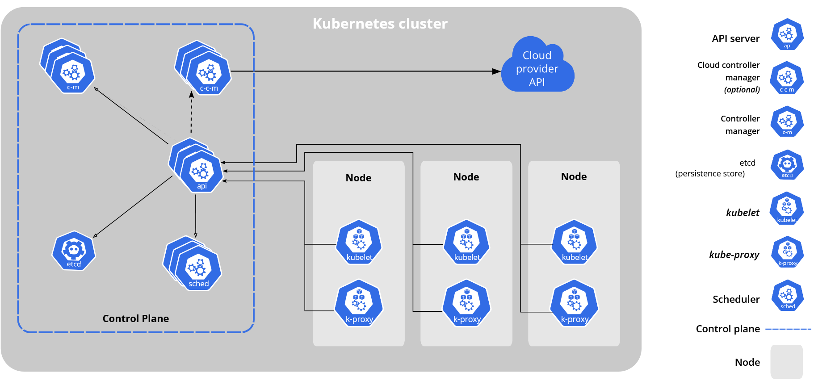

# 🚀 AWS DevOps CI/CD & GitOps Pipeline

This repository demonstrates a **production-grade CI/CD & GitOps pipeline** deployed on **AWS EKS**, integrating modern DevOps tools to ensure continuous integration, delivery, and deployment with full automation, quality, and security.

---

## 🧩 Project Overview

This project builds an automated pipeline for a Java (Maven) application that:

- ✅ Pulls source code from **GitHub**
- ✅ Builds and tests via **Jenkins** (Master-Agent architecture)
- ✅ Performs **static code analysis** using **SonarQube** with Quality Gates
- ✅ Runs **dual-layer vulnerability scans** using **Trivy** (filesystem + Docker image)
- ✅ Builds and pushes Docker images to **DockerHub**
- ✅ Deploys to **AWS EKS (Kubernetes)** via **ArgoCD (GitOps)**
- ✅ Auto-scales with **Horizontal Pod Autoscaler (HPA)**
- ✅ Sends build notifications via **Gmail** (optional)

> **Note:** All infrastructure components (Jenkins, SonarQube, EKS Server) are hosted on **AWS EC2 instances**.  
> Future versions will include **Terraform automation** for complete infrastructure provisioning.

---

## 🏗️ Architecture Overview

The end-to-end DevOps pipeline workflow:

```
┌─────────────┐
│   GitHub    │ (Source Code)
└──────┬──────┘
       │
       ▼
┌─────────────────────────────────────────────────┐
│              Jenkins Pipeline                   │
│  ┌──────────┐  ┌──────────┐  ┌──────────┐     │
│  │  Build   │→ │ SonarQube│→ │  Trivy   │     │
│  │  & Test  │  │ Analysis │  │  Scan    │     │
│  └──────────┘  └──────────┘  └──────────┘     │
│         │                            │          │
│         ▼                            ▼          │
│  ┌──────────────────┐       ┌─────────────┐   │
│  │  Docker Build    │       │   Trivy     │   │
│  │  & Push to Hub   │──────→│ Image Scan  │   │
│  └──────────────────┘       └─────────────┘   │
└────────────────┬────────────────────────────────┘
                 │
                 ▼
       ┌─────────────────┐
       │  Trigger GitOps │
       │   CD Pipeline   │
       └────────┬────────┘
                │
                ▼
       ┌─────────────────┐
       │     ArgoCD      │ (GitOps Operator)
       │   Auto-Sync     │
       └────────┬────────┘
                │
                ▼
       ┌─────────────────┐
       │   AWS EKS       │
       │  ┌──────────┐   │
       │  │   Pods   │   │
       │  │  (2-10)  │◄──┤ HPA (Auto-scaling)
       │  └──────────┘   │
       └─────────────────┘
                │
                ▼
       ┌─────────────────┐
       │  Gmail Notify   │
       └─────────────────┘
```

---

## 🔄 Pipeline Stages Explained

### 1️⃣ **Code Commit & Trigger**
- Developers push code to GitHub
- Jenkins pulls code using GitHub Personal Access Token

### 2️⃣ **Build & Unit Tests**
- Maven compiles Java application
- Runs unit tests on Jenkins Agent (Docker-enabled)

### 3️⃣ **SonarQube Code Analysis**
- Static code analysis for bugs, vulnerabilities, and code smells
- **Quality Gate** validation (build fails if gate fails)
- Webhook reports results back to Jenkins

### 4️⃣ **Trivy Security Scans (Dual-Layer)**
- **Stage 1:** Filesystem scan (checks source code dependencies)
- **Stage 2:** Docker image scan (checks final containerized application)
- Generates JSON and HTML reports

### 5️⃣ **Docker Build & Push**
- Builds Docker image with unique tag (e.g., `v1.0.3`)
- Pushes to DockerHub repository

### 6️⃣ **GitOps Trigger**
- Jenkins triggers ArgoCD pipeline via API
- Updates Kubernetes manifest with new image tag
- Commits changes to GitOps repository

### 7️⃣ **ArgoCD Deployment**
- ArgoCD detects manifest changes
- Automatically syncs to EKS cluster
- Deploys new Pods with rolling update strategy

### 8️⃣ **Auto-Scaling (HPA)**
- Monitors CPU usage
- Scales Pods between 2-10 replicas based on load

### 9️⃣ **Notification**
- Gmail sends build status (Success/Failure)

---

## 🧰 Tools & Technologies

| Category | Tool / Service | Purpose |
|----------|----------------|---------|
| **Cloud** | AWS EC2, EKS | Infrastructure hosting |
| **CI/CD** | Jenkins (Master-Agent) | Build automation |
| **Code Quality** | SonarQube + PostgreSQL | Static code analysis |
| **Security** | Trivy | Vulnerability scanning |
| **Container** | Docker, DockerHub | Image build & registry |
| **Orchestration** | Kubernetes (EKS) | Container orchestration |
| **GitOps** | ArgoCD | Declarative deployment |
| **Auto-Scaling** | HPA (Horizontal Pod Autoscaler) | Dynamic scaling |
| **Notification** | Gmail SMTP | Build alerts |
| **IaC (Planned)** | Terraform | Infrastructure automation |

---

## 📊 Key Features

### ✨ **CI/CD Best Practices**
- ✅ Separated Jenkins Master-Agent architecture
- ✅ Pipeline-as-Code (Jenkinsfile in repo)
- ✅ Automated quality gates
- ✅ Security-first approach (Trivy scans)

### ✨ **GitOps Workflow**
- ✅ Declarative Kubernetes manifests
- ✅ Git as single source of truth
- ✅ Automatic sync with ArgoCD
- ✅ Rollback capability

### ✨ **Production-Ready**
- ✅ Auto-scaling based on metrics
- ✅ Resource limits defined
- ✅ High availability (min 2 replicas)
- ✅ Health checks implemented

---

## ⚙️ Prerequisites

Before starting the installation, ensure you have:

- ✅ **AWS Account** with EC2 and EKS permissions
- ✅ **AWS CLI** installed and configured (`aws configure`)
- ✅ **SSH Key Pair** for EC2 instance access
- ✅ **GitHub Account** with Personal Access Token
- ✅ **DockerHub Account** with Access Token
- ✅ **Gmail Account** with App Password (for notifications)
- ✅ Basic knowledge of Linux, Docker, and Kubernetes

---

## 📘 Installation Guide

For complete step-by-step setup instructions, please refer to:

### 👉 [installation.md](./installation.md)

The guide covers:
1. Jenkins Master & Agent setup
2. SonarQube with PostgreSQL configuration
3. Trivy integration
4. AWS EKS cluster creation
5. ArgoCD GitOps setup
6. HPA configuration
7. Troubleshooting tips

---

## 🖼️ Screenshots

### Jenkins Pipeline


### SonarQube Analysis


### ArgoCD Application


### Kubernetes Dashboard


---

## 🚀 Quick Start

```bash
# Clone the repository
git clone https://github.com/sadikgok/devops-03-pipeline-aws-gitops.git
cd devops-03-pipeline-aws-gitops

# Follow installation.md for detailed setup

# After setup, trigger Jenkins pipeline
# Jenkins will automatically:
# 1. Build application
# 2. Run tests
# 3. Analyze code quality
# 4. Scan for vulnerabilities
# 5. Build Docker image
# 6. Deploy to EKS via ArgoCD
```

---

## 📁 Repository Structure

```
devops-03-pipeline-aws-gitops/
├── README.md                    # This file
├── installation.md              # Detailed setup guide
├── Jenkinsfile                  # CI pipeline definition
├── images/                      # Documentation screenshots
│   ├── jenkins-pipeline.png
│   ├── sonarqube-dashboard.png
│   ├── argocd-application.png
│   └── kubernetes-pods.png
├── kubernetes/                  # K8s manifests (separate GitOps repo)
│   ├── deployment.yaml
│   ├── service.yaml
│   └── hpa.yaml
├── src/                         # Java application source
│   └── main/
├── pom.xml                      # Maven configuration
└── .gitignore
```

---

## 🧪 Testing the Pipeline

### Load Testing (HPA)
```bash
# Install Apache Bench
sudo apt-get install apache2-utils -y

# Generate load
kubectl get svc  # Get LoadBalancer URL
ab -n 10000 -c 100 http://<LOADBALANCER_URL>:8080/

# Watch HPA scale pods
kubectl get hpa -w
```

### Manual Deployment
```bash
# Force ArgoCD sync
argocd app sync devops-03-pipeline-cd

# Check deployment status
kubectl get pods
kubectl get deployments
kubectl describe hpa
```

---

## 🧹 Cleanup

```bash
# Delete EKS cluster
eksctl delete cluster --name my-workspace --region us-east-1

# Clean Docker images on Jenkins Agent
docker system prune -a -f

# Stop/Terminate EC2 instances:
# - JenkinsMaster
# - JenkinsAgent
# - SonarQube
# - EKS-Server
```

---

## 🐛 Troubleshooting

Common issues and solutions are documented in [installation.md - Troubleshooting Section](./installation.md#-13-troubleshooting)

Quick checks:
```bash
# Jenkins Agent connection
ssh ubuntu@<AGENT_IP>

# SonarQube logs
sudo tail -f /opt/sonarqube/logs/sonar.log

# ArgoCD app status
argocd app get devops-03-pipeline-cd

# Kubernetes pods
kubectl get pods -n default
kubectl logs <POD_NAME>
```

---

## 🎯 Next Steps & Roadmap

- [ ] **Terraform Integration** - Automate EC2 and EKS provisioning
- [ ] **Monitoring Stack** - Add Prometheus + Grafana for metrics
- [ ] **Logging Stack** - Integrate ELK (Elasticsearch, Logstash, Kibana)
- [ ] **Slack Notifications** - Replace Gmail with Slack webhooks
- [ ] **Multi-Environment** - Add Dev, Staging, Production pipelines
- [ ] **Helm Charts** - Convert manifests to Helm for better management
- [ ] **Sealed Secrets** - Secure secret management in GitOps
- [ ] **Service Mesh** - Implement Istio for advanced traffic management

---

## 📚 Learning Resources

- [Jenkins Documentation](https://www.jenkins.io/doc/)
- [SonarQube Docs](https://docs.sonarqube.org/)
- [Trivy Security Scanner](https://aquasecurity.github.io/trivy/)
- [ArgoCD Getting Started](https://argo-cd.readthedocs.io/)
- [AWS EKS Best Practices](https://aws.github.io/aws-eks-best-practices/)
- [Kubernetes Documentation](https://kubernetes.io/docs/)

---

## 🤝 Contributing

Contributions are welcome! Please:
1. Fork the repository
2. Create a feature branch (`git checkout -b feature/improvement`)
3. Commit changes (`git commit -m 'Add new feature'`)
4. Push to branch (`git push origin feature/improvement`)
5. Open a Pull Request

---

## 📄 License

This project is licensed under the MIT License - see the [LICENSE](LICENSE) file for details.

---

## 👨‍💻 Author

**Sadık Gök**  
DevOps Engineer | AWS | Jenkins | Docker | Kubernetes | ArgoCD | Terraform

📫 **Contact:**
- 🔗 [GitHub](https://github.com/sadikgok)
- 💼 [LinkedIn](https://linkedin.com/in/sadik-gok)
- ✉️ Email: sadik.gok@gmail.com

---

## ⭐ Support

If you found this project helpful:
- ⭐ **Star this repository**
- 👁️ **Watch for updates**
- 🍴 **Fork to customize**
- 📢 **Share with the DevOps community**

---

**Built with ❤️ for the DevOps Community**

*Last Updated: November 2025*